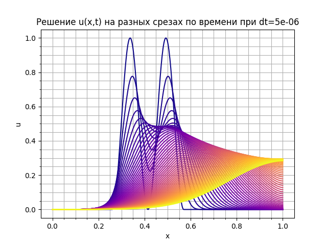
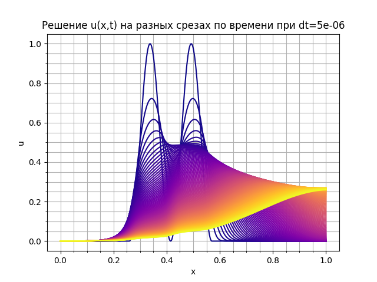
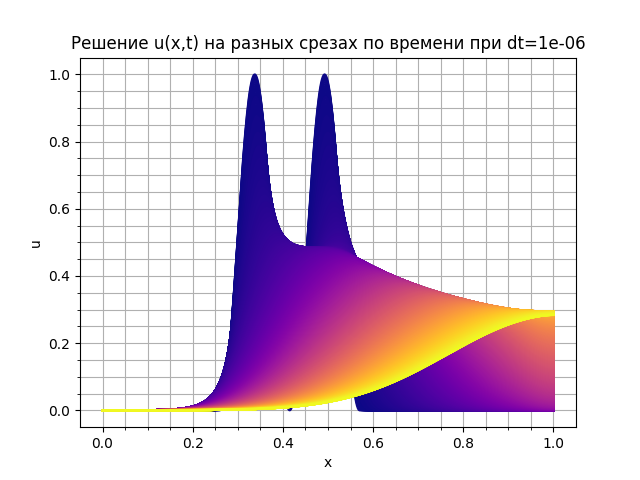

# Решение уравнения конвекции-диффузии в одномерной области

Уравнение в общем виде:

$$
\frac{\delta u}{\delta t} = - \vec {v} \cdot \nabla u + \nabla \cdot ((\kappa + \alpha u) \nabla u)
$$

$$
\kappa - \text{коэффициент диффузии}
$$

$$
\alpha - \text{коэффициент нелинейности}
$$

$$
\vec{v} - \text{скорость конвекции, const в задаче}
$$

## Начальное условие 

Начальное условие имеет вид:

$$
u(x, 0) = \sin(2 \pi \frac{x - 0.26}{0.57 - 0.26})^2 \qquad x \in \[0.26, 0.57]\ \qquad else\\ 0
$$

Граничные условия учитываются автоматически.

## Решение

Матрица жесткости связана с диффузией, далее нелинейная диффузионная матрица, которая вносит нелинейность, имеет вид:

$$
D_{ij} = \int_{\Omega} (\kappa + \alpha u) \nabla \phi_j \cdot \nabla \phi_i d \Omega
$$

Матрица масс M связана с временной зависимостью $\frac{\delta u}{\delta t}$ :

$$
M_{ij}= \int_{\Omega} \phi_j \phi_i d \Omega
$$

Матрица конвекции C :

$$
C_{ij} = \int_{\Omega} \phi_j \nabla \phi_i d \Omega
$$

Общая система имеет вид:

$$
M \frac{dU}{dt} + vCU + D(U)U = 0
$$

Задача решается с использование метода Рунге-Кутты 2-го порядка для интегрирования по времени.

## Задача: найти $u(x, t)$ и построить графики распределения на различных временных срезах.

## Программная часть

Класс $\textbf{ConductionOperator}$ собирает массовую, конвективную и матрицу жесткости.

Интегрируется слабая формулировка.

На каждом временном шаге вычисляется правая часть с помощью метода RK2Solver.

## Результаты расчетов

Экспериментальным способом был подобран шаг для отображения корректного результата.

Наболее 1й график. Параметры, выбранные для получения данного графика.

$$
dt = 5 \cdot 10^{-6},\qquad \text{срез по времени берётся равным 2000}
$$

 

 

 

 

Также, ради интереса были проверены методы RK4 и RK6 порядков, различий по графикам не возникло. Поэтому с таким шагом dt RK2 имеет хорошую точность вычисления u(x,t).
