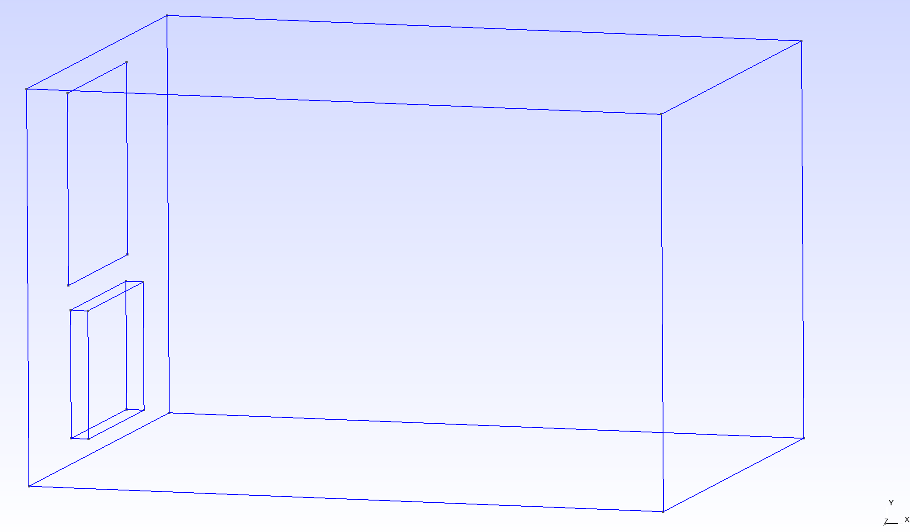

# Решение уравнения теплопроводности для комнаты с обогревателем и граничными условиями в виде стен и окна

Уравнение Лапласа с однородными граничными условиями Дирихле:
(Сильная формулировка)

$$
\Delta u = f\\ \in\\ \Omega
$$

$$
u = g\ \in\\ \delta \Omega
$$

# Вариационная формулировка или Слабая формулировка
Берем тестовую функцию, домножаем обе стороны сильной формулировки

$$
\- \int_{\Omega}( \nabla u \nabla vdV + c \int_{\Omega} uvdV =\int_{\Omega} fvdV\\ \qquad \forall v\\    \qquad      (1)
$$

$$
\Delta u = f\\ \in\\ \Omega
$$

$$
u = g\ \in\\ \delta \Omega
$$

Задача: найти $u\\ \in\\ H^{1}(\Omega)$ для которых верно (1) for $\forall v\\ \in\\ H^{1}(\Omega)$

Уточнения:

$$
H^1 \text{ - пространство Соболева}
$$
+ \+ добавляются граничные условия

# Для построения геометрии комнаты был использован FreeCAD

Модель комнаты находится в файле с раширением .brep

Параметры комнаты:

• Размер комнаты: $5.6 \times 3.8 \times 3.1$ м.

• Размер окна: $1.6 \times 1.5$ м.

• Размер радиатора: $1.5 \times 0.14 \times 1.0$ м.

 

# Для построения сетки был использован GMSH
Подробности в файле с раширением .geo

Атрибуты объема:

+ Heater == 1
+ Air Volume == 2

Атрибуты плоскостей:

+ Window == 1
+ Walls == 2

Для учета градиента умельчена сетка внутри радиатора.
